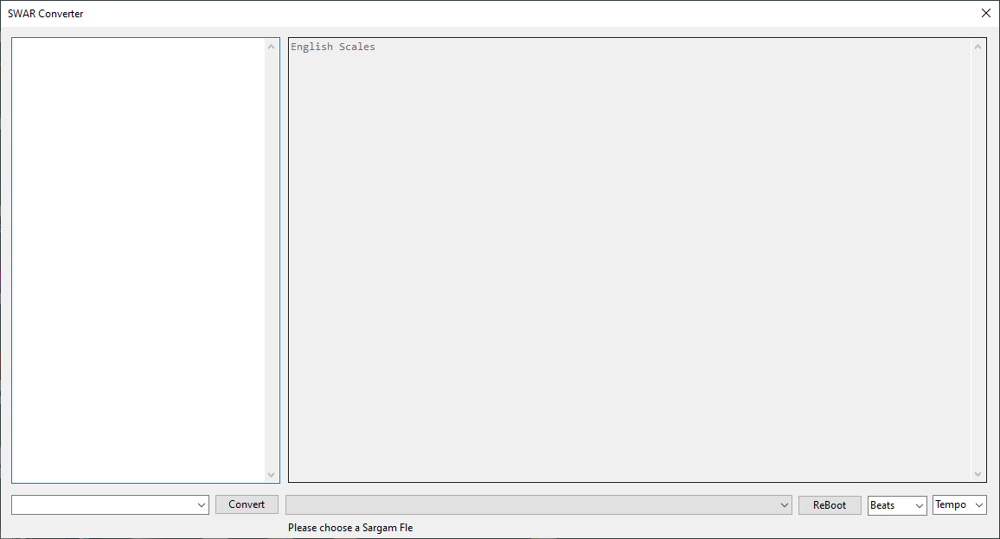

# swar
Convert SARGAM Notes to English Scales __and__ XPT Pattern File for [LMMS](https://lmms.io/).

Originally, this is an temporary/alternative solution for [Custom Piano Labels](https://github.com/LMMS/lmms/issues/6162).
But the binary file can be used as an independent software as well.

This source code is put into public domain.

## Configurations

### Read/Write Directory
[Configuration File](swar/configs/Configurations.cs) reads a directory to export LMMS .xpt files.
Create a Windows directory `d:/projects/xpt.lmms/`. Your swar executable files can be anywhere.

### license.txt
Put "100" without quotes to `d:/projects/xpt.lmms/license.txt` file for features unblocked to premium.

### Sargams: Read File List
Create d:/desktop/xpt/sargams.txt file with a full path to a sargam note.
When the application starts, it reads the sargam notations from files listed in `sargams.txt` file.
Each line mentions a full path of a sargam note.
A `#` character is a comment, when used in the front of the line.
Make sure that the full path is valid, and sargam note exists.
Recommended file name is: `<project>/notations/notations-sargams.txt`.

## Important Files

* XML Handler, [see here](swar/libraries/XMLHandler.cs).
* File Formatter, [see here](swar/libraries/Formatter.cs).
* SARGAMs Replacer, [see here](swar/libraries/Replacer.cs).

# Software Interface

Click on the image for high resolution clarity.

* Left: Sargam Notes (Paste your unformatted sa, re, ga, ma, ... notes)
* Right: English scales will be auto converted and formatted.

It will write `lmms-*.xpt` chunk files when the sargam notes change.
You can later import these xpt xml files directly in the pianoroll of LMMS.

* Bottom Left: Proposed source format chooser.
* Bottom Right: sargams.txt contents.
* Beats: Proposed pupular Time Signatures.
* Tempo: Proposed pupular tempos.
* Piano Keyboard: Clicking here will append a corresponding sargam note.
* Special keys: This will also enter the contents in the sargam editor.

This is a work in progress, and any content, documentation, source code, compiled binaries, etc. are subject to change.
