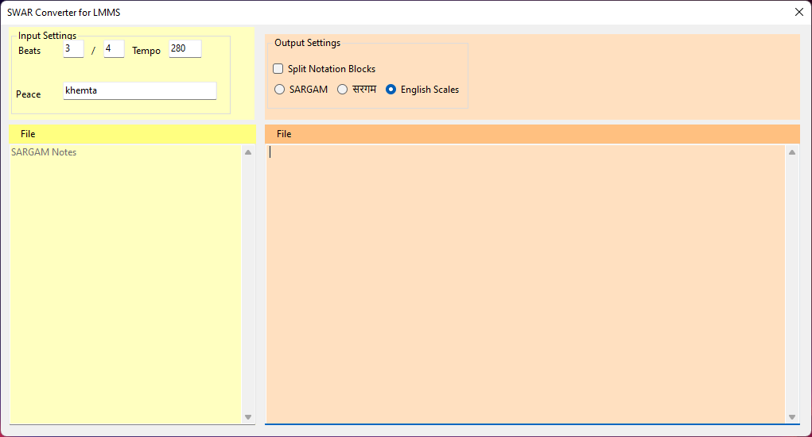

# swar
Convert SARGAM Notes to English Scales and XPT Pattern Files.

Originally, this is a temporary solution for Custom Piano Labels for LMMS using a reverse method.
Here is the [discsussion thread](https://github.com/LMMS/lmms/issues/6162). The binary file can be used as an independent software.

This source code is put to public domain.

## Configurations

### Read/Write Directory
[Configuration File](swar/configs/Configurations.cs) reads a directory to export LMMS .xpt files.
Create a Windows directory `d:/desktop/xpt`. Your swar executable files can be anywhere.

### license.txt
Put "100" without quotes to `d:/desktop/license.txt` file for features unblocked to premium.

### Sargams: File List
Create d:/desktop/xpt/sargams.txt file with a full path to a sargam note.
When the application starts, it reads the sargam notations from `sargams.txt` file.
Each line mentions a full path of a sargam note.
A `#` character is a comment, when used in the front of the line.
Make sure that the full path is valid, and sargam note exists.
Recommended file name is: `notations-sargams.txt`.

## To use with LMMS Software
The purpose of this application is to produce LMMS based XML Pattern File named .xpt.
Every sargam file it reads will be converted into lmms.xpt.
For more details on LMMS, [visit here](https://lmms.io/).

* For more details on XML Handler, [see here](swar/libraries/XMLHandler.cs).
* For more details on File formatter, [see here](swar/libraries/Formatter.cs).
* For more details on SARGAMs replacer, [see here](swar/libraries/Replacer.cs).

# Software Interface

Click on the image for clarity.

* Left: Sargam Notes (Paste your unformatted sa, re, ga, ma, ... notes)
* Right: English scales will be auto converted and formatted.

It will write `lmms-*.xpt` chunk files when the sargam notes change.
You can later import these xpt xmls directly in the piano roll.

* Bottom Left: Proposed source format chooser.
* Bottom Right: sargams.txt contents.
* Beats: Proposed pupular Time Signatures.
* Tempo: Proposed pupular tempos.
* Piano Keyboard: Clicking here will append a corresponding sargam note.
* Special keys: This will also enter the contents in the sargam editor.

This is a work in progress, and any content, documentation, source code, compiled binaries, etc. are subject to change.
